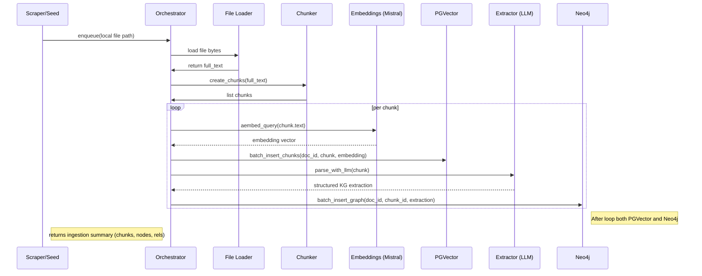

# Ingestion Flow (per document)

Short: load → chunk → embed → store vectors → extract KG → store graph.

Notes / actions:
- Ensure idempotent upserts (avoid duplicates).
- Add retry/backoff around LLM & DB writes.
- Avoid destructive migration (no TRUNCATE in production).