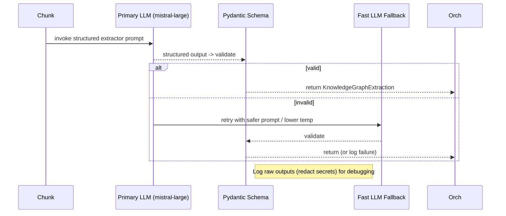

# Extraction Flow (KG extraction)

Sequence illustrating LLM extraction, validation, and fallback.

```mermaid
sequenceDiagram
  participant Chunk as Chunk
  participant LLM as Primary LLM (mistral-large)
  participant Schema as Pydantic Schema
  participant Fallback as Fast LLM Fallback
  Chunk->>LLM: invoke structured extractor prompt
  LLM-->>Schema: structured output -> validate
  alt valid
    Schema-->>Orch: return KnowledgeGraphExtraction
  else invalid
    LLM->>Fallback: retry with safer prompt / lower temp
    Fallback-->>Schema: validate
    Schema-->>Orch: return (or log failure)
  end

  Note right of Schema: Log raw outputs (redact secrets) for debugging
```

Actionables:
- Add retry/backoff and error logging.
- Sanitize and validate before DB writes.