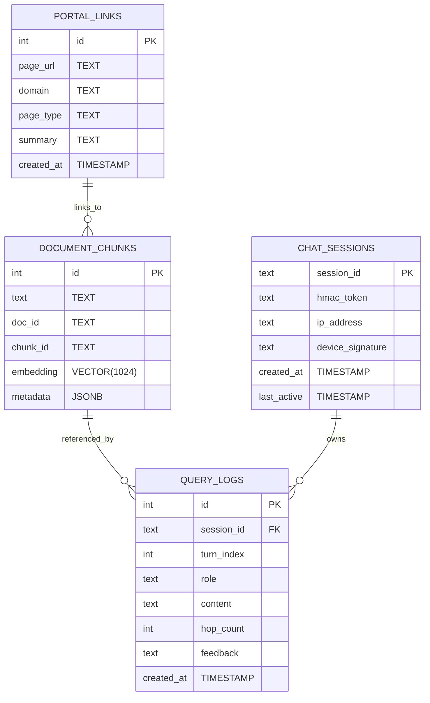

# Storage Schema Overview

ER-like view of the main tables used by the system.

Notes:
- `document_chunks.embedding` uses HNSW index for similarity searches.
- Use migrations for schema changes; avoid in-code TRUNCATE.